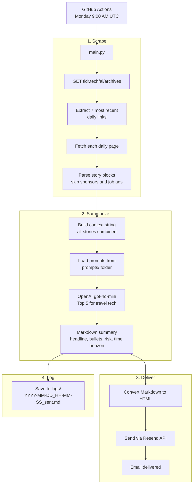

# TLDR AI Bot

A Python automation that scrapes the last 7 days of [TLDR AI](https://tldr.tech/ai/archives), uses OpenAI to extract the 5 most commercially relevant stories for a travel technology company, and emails the summary every Monday morning via [Resend](https://resend.com).

---

## How it works



---

## Project structure

```
tldr-bot/
├── main.py                   # Core script: scrape, summarise, send, log
├── requirements.txt          # Python dependencies
├── .env.example              # Template for required environment variables
├── .gitignore                # Excludes venv, .env, logs
├── README.md                 # This file
│
├── prompts/                  # LLM prompt templates (edit here to change output)
│   ├── tldr_report_system.txt  # System message: persona, tone, format rules
│   ├── tldr_report_user.txt    # User prompt: task, evaluation criteria, structure
│   └── README.md               # Notes on versioning prompts
│
├── logs/                     # Auto-created, gitignored
│   └── YYYY-MM-DD_HH-MM-SS_sent.md  # Datestamped log of each run
│
└── .github/
    └── workflows/
        └── monday_update.yml  # GitHub Actions cron trigger (to be added)
```

---

## Setup

### 1. Clone and create virtual environment

```bash
git clone <your-repo-url>
cd tldr-bot
python3 -m venv venv
source venv/bin/activate  # Windows: venv\Scripts\activate
pip install -r requirements.txt
```

### 2. Configure environment variables

Copy `.env.example` to `.env` and fill in:

| Variable | Description |
|---|---|
| `OPENAI_API_KEY` | OpenAI API key for summarisation |
| `RESEND_API_KEY` | Resend API key (starts with `re_`) |
| `EMAIL_FROM` | Verified sender address e.g. `tldr@yourdomain.com` |
| `EMAIL_TO` | Recipient address |

> **Note:** `EMAIL_FROM` must use a domain verified in your [Resend dashboard](https://resend.com/domains). For testing only, use `onboarding@resend.dev` and set `EMAIL_TO` to your own Resend account email.

---

## Running

```bash
# Full run: scrape + summarise + send email
python main.py

# Dry run: scrape + summarise + print to console (no email)
python main.py --dry-run
```

---

## Prompt templates

The report is generated by two prompt files in `prompts/`:

- **`tldr_report_system.txt`** — defines the model's persona and output rules. Edit this to change tone or format constraints.
- **`tldr_report_user.txt`** — defines the task, evaluation criteria, and output structure. Edit this to change what the model looks for or how results are presented.

Both files are loaded at runtime, so changes take effect immediately without touching `main.py`. Commit changes to track prompt history in Git.

---

## Logs

Every run saves a Markdown file to `logs/` with the format:

```
logs/2026-02-17_20-07-57_sent.md
logs/2026-02-17_09-00-00_failed.md
logs/2026-02-17_08-55-00_dry-run.md
```

Each log contains the run date, status, and the full generated summary. The `logs/` folder is gitignored so files stay local.

---

## GitHub Actions (Monday trigger)

Add `.github/workflows/monday_update.yml` to automate the weekly send:

```yaml
name: Monday TLDR Summary

on:
  schedule:
    - cron: '0 9 * * 1'   # Every Monday at 9:00 AM UTC
  workflow_dispatch:         # Also allows manual trigger from GitHub UI

jobs:
  send-summary:
    runs-on: ubuntu-latest
    steps:
      - uses: actions/checkout@v4
      - uses: actions/setup-python@v5
        with:
          python-version: '3.11'
      - name: Install dependencies
        run: pip install -r requirements.txt
      - name: Run TLDR bot
        run: python main.py
        env:
          OPENAI_API_KEY: ${{ secrets.OPENAI_API_KEY }}
          RESEND_API_KEY: ${{ secrets.RESEND_API_KEY }}
          EMAIL_FROM: ${{ secrets.EMAIL_FROM }}
          EMAIL_TO: ${{ secrets.EMAIL_TO }}
```

Add the four secrets in your GitHub repo under **Settings → Secrets and variables → Actions**.

---

## Dependencies

| Package | Purpose |
|---|---|
| `beautifulsoup4` | HTML parsing for scraping |
| `requests` | HTTP requests to TLDR and Resend |
| `openai` | GPT-4o-mini summarisation |
| `resend` | Transactional email delivery |
| `python-dotenv` | Load `.env` variables |
